Introduction
============

The goal of this lab was to implement an implement a 32-bit MIPS
processor. We had to use our knowledge of MIPS assembly language and
MIPS processor data path for this lab. We had to use VHDL language to
write the components as well as schematic in Xilinx software to combine
them to create the processor. The final schematic for the processor
after all the components have been combined is:

This schematic follows the design of MIPS processor given in lab
instruction. This design has 2 inputs. One clock and another enable
signal. The clock signal (CLK) and enable signal (EN) are passed to FSM
module that is the controller for whole processor. When enable pin is
on, the FSM starts and on every rising edge of clock FSM changes state.

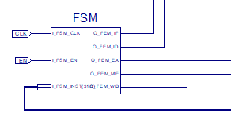

I also put an output because without an output pin Xilinx would discard
the whole design without during optimization. Also it shows what value
the processor writes back to register. Otherwise the design follows the
exact specification of lab instruction.

Also I used following project description. The ram has 256 bytes memory
which does not fit in smaller device so I used larger device to fit
that. I used Spartan3E family, XC3S500E device and FG320 package to test
and simulate on Xilinx.

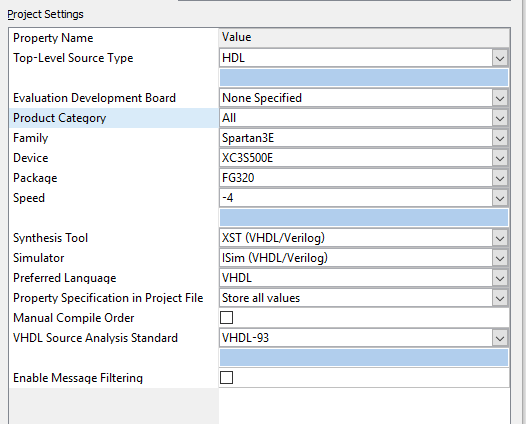

I created all the modules in VHDL and tested on Xilinx using this
project setting.

Modules
=======

Here we can see that it has following modules:

 | 	   |Name        |Description
 |---  |---- 		|---
 |1    |FSM         |State Machine Module
 |2    |PC          |Program Counter
 |3    |ROM         |Instruction Memory
 |4    |ADD1        |adder that incitements input by 4
 |5    |CTL         |Controller module
 |6    |MUX5        |2 to 1 ,5 bit, Multiplexer to select write register
 |7    |REG         |Register module
 |8    |EXT         |Sign Extension Module
 |9    |ALUCTR      |ALU Control module
 |10   |MUX32 (1)   |2 to 1 ,32 bit, Multiplexer to select 2^nd^ input to ALU
 |11   |ADD2        |adder that adds 2 input, PC and sign extended immediate here
 |12   |MUX32 (2)   |2 to 1 ,32 bit, Multiplexer to select next PC
 |13   |ALU         |ALU Module
 |14   |RAM         |Data Memory
 |15   |MUX32 (3)   |2 to 1 ,32 bit, Multiplexer to select data for write back to register

The description of these modules is given below:

 FSM
----

This module is brain of the processor. It is state machine that decides
which state the processor is operating in. It has 2 input for enable
signal and clock and 5 output for each state of processor. These inputs
are same as the inputs of the overall Processor. The outputs are then
connected to different modules to enable them based on which stage the
processor is on.

The ports in this module are:[]{#_MON_1557424986 .anchor}

I also created a latch to define the states:

Initially when enable signal (I\_FSM\_EN) is 0, I set the State to be
S\_IF. When enable signal is sent, on each rising edge of clock
(I\_FSM\_CLK) I change the stage to next stage. I have switch case
statement inside rising edge check to change the stage on every stage.
Here every time the state chances I set State to be the next stage, and
set all output except the one for current stage to 0.

For example when next State to run is S\_ID and when next rising clock
happens:

Here I set O\_FEM\_ID to 1 since it is ID stage. I set State to S\_EX
since that is next state. However I check during ID State if the
instruction is all 0. If it is I go to end stage where all outputs are
0. This is because ROM has 0 in memory if there is no code. So I just
stop after that.

My Flow chart is:

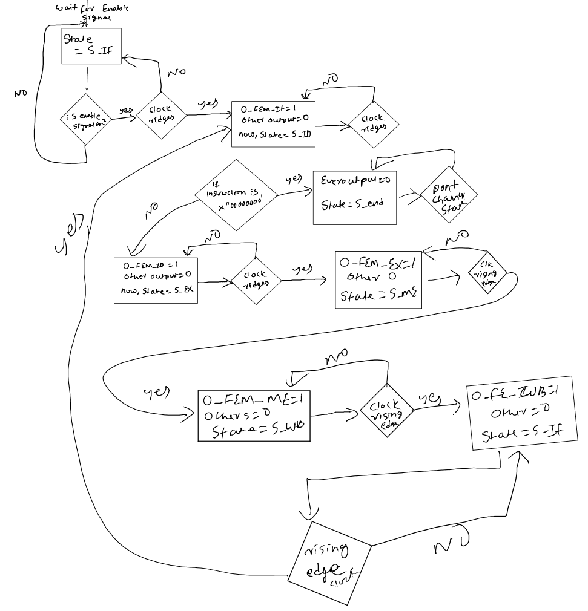

Based on flow chart we can see that each outputs are related to the
current state of FSM.

|Output		|State in code	| MIPS pipeline stage	| Connection| Job
|---    	|---			|---					|---		|---
|O_FEM_IF	|S_IF			|Instruction fetch		|ROM		|Enables ROM to spit out next instruction
|O_FEM_ID 	|S_ID			|Instruction ID			|CTL		|Enables Control module (CTL) to spit out control signal based on the instruction spit out by ROM in IF stage
|O_FEM_EX;	|S_EX			|						|ALU		|Enables ALU module to perform operation, add and comparison for equality for this lab
|O_FEM_ME	|S_ME			|						|RAM		|Enables operation in RAM to allow read and write
|O_FEM_WB	|S_WB			|						|REG and PC	|Enables REG module to  write to register, |Enables PC to set its output PC to be equal to its input. 

Based on these connections we can see that FSM is the brain of
Processor. I simulated this module by feeding a clock and non 0
instruction as follows to see the flow.

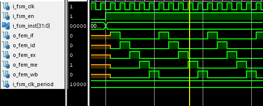

Here we can see that on every rising edge of clock IF, ID, EX, ME, WB
output based on current state are enabled while others disabled. The
flow goes from IF-\>ID-\>EX-\>ME-\>WB-\>IF like in flow chart. There is
no output when signal is disabled.

PC
--

It is program counter that feeds the address of instruction in ROM that
processor executes. It Has 2 inputs. One is 1 bit enabler
(I\_PC\_UPDATE). On the processor it is connected the O\_FEM\_Wb signal
from FSM to instruct PC fetch next address. The next address is given to
this module via other input I\_PC which is 32 bit input. It has output
of 32 bit called O\_PC which is set to I\_PC when I\_PC\_UPDATE is
enabled.

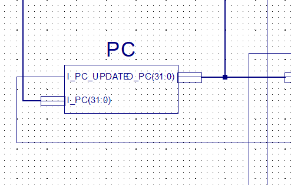

This module has simple logic which says that if I\_PC is enabled set
O\_PC to be same as I\_PC. However I had to create a register to store
the current address.

I always set output to this register all the time but I only update the
register on rising edge of enable signal. I did this to make the timing
of update more predictable.

The simulation for this is:

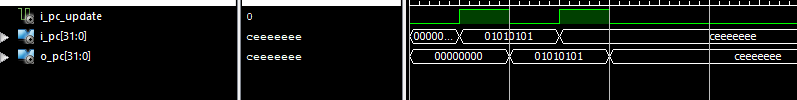

So we can see that it just updates the PC. Output becomes same as input
when update signal is on.

The output O\_PC is connected to ROM of the processor. This address is
updated on WB state of the last code. So it fetches address for next
instruction. Also, since there is no WB stage to update the address in
beginning, the register reg is initialed to be 0. So the processor reads
code at 0 position first.

Rom
---

This is read only memory for processor that stores the code of the lab.
I used the code from lab instruction to read the Fibonacci number
calculating code. I converted the MIPS code to binary using MARS
software as instructed in instruction. Then I modifier the VHDL code
given in lab instruction. The lab instruction had VHDL that creates a
register of 256 bytes (array of 256 bytes, byte is vector of 8 bits).
Then it initializes the register by filling it with the code from file
that I got from MARS software as instructed. This is done via the impure
function that takes the file name, reads the file line by line and
converts the string to binary. Each code is 4 byte. So it fills the code
in Little Endian mode. The highest byte of the code is in bigger
address. So for each address it gets it spits out 4 bytes from that
address.

My ports are:

I\_ROM\_EN is enable signal. I\_ROM\_ADDR is the address of the code
given by PC module. So if it gets enabled signal it get 4 bytes of data
starting from that address and sets output O\_ROM\_DATA to that. I
convert the input address to integer to get the index of data.

Here rom is little endian so most significant byte is at highest byte,
so read 4^th^ byte in memory as most significant.

Simulation of this code is:

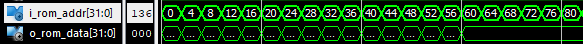

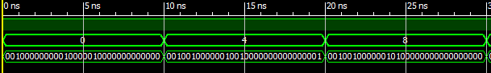

So we see the codes from Fibonacci as:

Line 1 = 0 = 00100000000010000010000000000000

Line 2 = 4 = 00100100000010010000000000000001

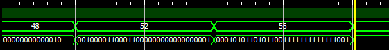

Line 15 = 56 = 00010101101011001111111111111001

So this is same as from Fibonacchi.bin file which I creates as
instructed.

ADD1
----

This is the adder module that increments input data by 4 and outputs it.
It has following ports:

So, I\_ADD1\_A is the 32 bit vector that takes input from PC. This
calculates the next instruction if there is no branch or jump. Since
each MIPS code is 4 byte but ROM is 1 byte the increment is done by 4
each instruction.

I used ieee.std\_logic\_unsigned.all library to enable + operator.

So, this outputs O\_ADD1\_out to adder and multiplexer. Adder adds to
the immediate value to get branch address for every code. However based
of control signal multiplexer choses if next PC is output from PC or
output from adder.

The simulation for this is:

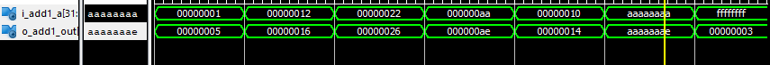

So we see that all the input is increased by 4.

CTL
---

This is the control module that generates the control signal during ID
stage of the processor. It takes 31^st^ to 26^th^ bit of opcode output
from the ROM module during IF stage. It takes enable signal which is
O\_FSN\_ID from FSM to enable it. Then it has different control signals
and ALUop vector (2 bit) that I calculate based on the MIPS
specification.

So I\_CTL\_EN is enable signal and I\_CTL\_INST is the 6 bit opcode from
the output of ROM. I connect the input via Schematic using bus.

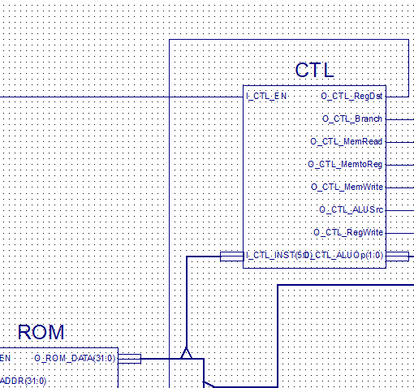

Then I have switch case statement that checks what the opcode
(I\_CTL\_INST) and sets the output when the control is enabled. The
specification is:

  Pin                Description   Meaning
  ------------------ ------------- --------------------------------------------------------------------------------------------------------------------------------------------------------------------------------------------------------------------------------------------------------------------------------------------------------------
  I\_CTL\_INST       Opcode        31 to 26 bit on instruction from ROM output
  O\_CTL\_RegDst     RegDst        Connected to 5 bit Multiplexer that takes 20 to 16 bit of instruction as input 0, and 15 to 11 in input 2. Both are register values. So if this is enabled the mux selects 2^nd^ register and sent to REG module as write register.
  O\_CTL\_Branch     Branch        This is connected to AND gate. The other input for and gate comes from ALU. For BNE instruction ALU compares them and outputs 1 if ALU inputs are not equal. So, if ALU has not equal and this signal is enabled the multiplexer for next PC gets 1 and next PC becomes the one calculated from instruction.
  O\_CTL\_MemRead    MemRead       It is connected to RAM and enables reading. It is not used for this lab.
  O\_CTL\_MemtoReg   MemToReg      It is connected to 32 bit multiplexer with output from ALU as 0^th^ input and output from RAM as 1^st^. It selects which data to write to register. So when this signal selects which data to write to register.
  O\_CTL\_MemWrite   MemWrite      It is connected to RAM and enables writing to RAM.
  O\_CTL\_ALUSrc     ALUSrc        It is connected to 32 bit MUX that selects between sign extended immediate value and register data to send to ALU.
  O\_CTL\_RegWrite   RegWrite      This is connected to REG and enables writing to register.
  O\_CTL\_ALUOp      ALuOp         This is connected to ALUCTRL which is ALU controller. ALU controller uses this and function bits from instruction to control which operation is done by ALU.

<table>
<thead>
<tr class="header">
<th>Instr</th>
<th>
Op

code
</th>
<th>RegDst</th>
<th>ALUSrc</th>
<th>
Mem

ToReg
</th>
<th>
Reg

Write
</th>
<th>
Mem

Read
</th>
<th>
Mem

Write
</th>
<th>Branch</th>
<th>ALuOp</th>
</tr>
</thead>
<tbody>
<tr class="odd">
<td>addu</td>
<td>000000</td>
<td>1</td>
<td>0</td>
<td>0</td>
<td>1</td>
<td>0</td>
<td>0</td>
<td>0</td>
<td>10</td>
</tr>
<tr class="even">
<td>addiu</td>
<td>001001</td>
<td>0</td>
<td>1</td>
<td>0</td>
<td>1</td>
<td>0</td>
<td>0</td>
<td>0</td>
<td>00</td>
</tr>
<tr class="odd">
<td>addi</td>
<td>001000</td>
<td>0</td>
<td>1</td>
<td>0</td>
<td>1</td>
<td>0</td>
<td>0</td>
<td>0</td>
<td>00</td>
</tr>
<tr class="even">
<td>sw</td>
<td>101011</td>
<td>0</td>
<td>1</td>
<td>0</td>
<td>0</td>
<td>0</td>
<td>1</td>
<td>0</td>
<td>00</td>
</tr>
<tr class="odd">
<td>bne</td>
<td>000101</td>
<td>0</td>
<td>0</td>
<td>0</td>
<td>0</td>
<td>0</td>
<td>0</td>
<td>1</td>
<td>01</td>
</tr>
</tbody>
</table>

I check for the opcode and update the data when enabled. However we need
the control signals in next stages which does operation based on these,
so I store the signals in register. I set output to the value of
register and only update the register value when enable signal is on.

The simulation for this is:

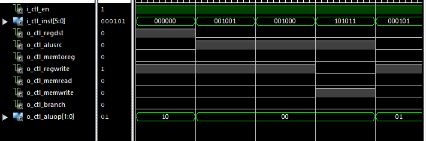

Here we can see how the output signals are changed same as in
specification based on I\_CTL\_INST values.

MUX5
----

This is the 5 bit multiplexer that is only used once in project. It has
2 5 bit inputs which comes from the output of ROM which is the
instruction to be executed. They are 20^th^ to 16^th^ bit, and 15^th^ to
11^th^ bit. Then the output of the MUX is connected to REG module to its
write register input. So this register takes the name of 2 register and
based on its selector, which is control signal I\_REG\_DST from CTL
module, selects which register is written.

The ports are:

The simulation for this is:

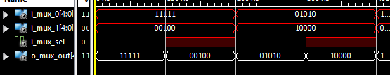

Here I see how the output is selected based on the selector signal.

REG
---

This is the register module that has the 32 registers. It has 3 input (5
bit) index of registers. It has 2 enable signals.

I created register as array of 32 vector of size 32 bit. I then
initialize them to 0.

Here I\_REG\_EN is enable signal from FSM (O\_FSM\_WB). So, when this
signal is on, it means it is write back stage. But it still has to check
if current instruction requires write back. So it has I\_REG\_WB signal
connected to CTL (O\_CTL\_RegWrite). If this is on then register
overwrites the data in index it gets from I\_REG\_RD.

Otherwise it just outputs the data on I\_REG\_SEL\_RS to O\_REG\_DATA,
and I\_REG\_SEL\_RT to O\_REG\_DATA\_B. The data is 32 bit. I do this by
simply converting the input bits to integer in VHDL and outputting the
data at those index.[]{#_MON_1557436802 .anchor}

EXT
---

This is sign extend module. It extends the input 16 bit to 32 bit. It
checks the most significant bit of input to check for sign. So if MSB
bit is, 4 byte of all 1 bits gets inserted to front of input else 4
byres of all 0 bit get inserted.

The simulation for this is:

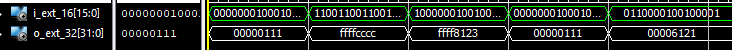

So we can see that if 1^st^ bit is 0 output has 0 inserted to front else
'f' is inserted.

ALUCTR
------

This is the ALU control module that converts the ALU op from control
module (CTL) and last 6 bits of instruction, which is function bits, to
give control signal to ALU. The ports are:

So, I\_ALU\_OP is ALU op from CTl. I\_ALU\_FUNCT is last 5 bits of
instruction I got from ROM. For this lab the FUNCT was irrelevant. I
just got ALU OP and compared it, in switch case statement, and set
output (O\_ALU\_CTR) based on MIPS specification of the instructions we
need for the lab.

MUX32
-----

I have 3 32 bit Multiplexer in this lab. This multiplexer has input 0
and input 1.

Then if selector (I\_MUX\_SEL) is 1, the output is set to input 1
(I\_MUX\_1) else it is set to input 0 (I\_MUX\_0).

My simulation for this is:

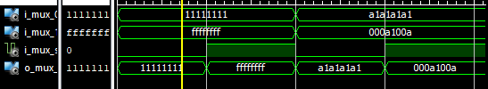

Here we can see that based on control the output value is same as input
1 when select is 2 and input 0 when select is 0.

### MUX to select 2^nd^ input of ALU

For this instance the input 1 is the second output of REG. In r-type
instruction we do operation in register data. So, controller (CTL) sets
its output O\_CTL\_ALU\_Src to 0. For i-type instruction, the selector
is 1 and it outputs second input. The second input is sign extended
immediate value. It is for I type instructions.

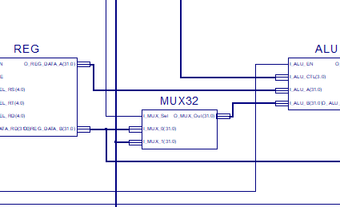

### MUX to select Next PC from between calculated BNE address and PC increment

For this input 0 is the PC incremented by 4 by ADD1 module. Input 1 is
the immediate value from instruction sign extended by EXT module, then
shifted by 2 bits and added to PC+4 by ADD2 module. The selector is the
logical and of control signal from CTL (O\_CTL\_Branch), to determine of
this is branch instruction, and output of ALU (O\_ALU\_Zero), that is 0
if branch is not equal. So ALU has 1 saying branch is not equal, and CTL
says it is branch then the selector for this mux is 1 and it outputs
branch add4ress. This output is then input for PC module which means
next instruction address is selected by this MUX\>

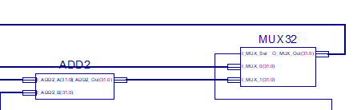

### Mux to select either ALU result or RAM output to get the data to be written to register 

This selects which data is written to register. It chooses between data
from ALU and data from RAM. For this the input 0 is output of ALU. For
add, sub and many other instruction we bypass RAM. For LW instruction we
need to read RAM data and write to register. The selector for this
instruction is CTL output O\_CTL\_MemtoReg. SO when it is on the
register gets data from Memory (RAM).

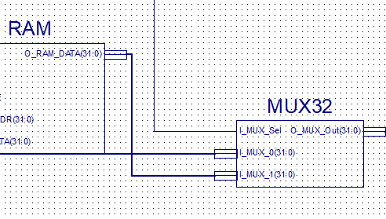

ADD2
----

This module takes sign extended immediate from EXT and shifts it by 2 0
bits and adds it to result from ADD1. Then it sends the result to MUX32
that selects next PC.

I\_ADD2\_A is output of ADD1 and A\_ADD2\_B is output of EXT. I do shift
and addition to second like:

I used the library ieee.std\_logic\_unsigned.all for + operator.

ALU
---

This module takes 4 inputs, 2 for control signals and 2 data inputs.
Based on control signals the ALU performs operation on data and outputs
to 2 output. My ports are:

Here I\_ALU\_A is the data from first register output. I\_ALU\_B is
either 2^nd^ register output or sign extended immediate data. I\_ALU\_EN
is the FSM output O\_FSM\_EX. So this ALU performs operation on output
on execution stage. For this it needs to check I\_ALU\_CTL which is
control vector from ALUCTRL module.

So, based in ALU ctrl input I perform following operation:

  |Alu Ctrl   |Instructions            |Operation
  |---------- |----------------------- |---------------------------------------
  |0010       |Addi, addiu, addu, sw   |Add inputs
  |0110       |bne                     |Subtract inputs, check if result is 0

I do this in VHDL like this:

So, for 0010 I just add and set output I\_ALU\_, for 0110 I compare the
inputs and output O\_ALU\_Zero = 0 if they are equal else I output
O\_ALU\_Zero = 1. If this is 0 then branch is not taken else it is. I
use register to store addition data because we need that on next stages
for operation.

I did the simulation if this as:

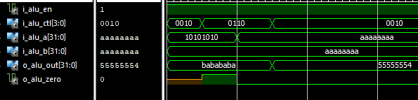

Here based on ALU control I added inputs for 0010 and compared data for
0110. When inputs are equal the output O\_ALU\_Zero is 1 else 0.

RAM
---

This is the memory of processor. For this I created an array of 256
bytes. Each bytes are vector of 8 bits all initialized to 0.

Then I store the data to RAM in big endian i.e. Small index has most
significant bit. The RAM has following ports:

Here there are multiple enable and control signals. I\_RAM\_EN comes
from FSM (O\_FSM\_ME) denoting that RAM is enabled on memory access
stage only. I\_RAM\_RE, and I\_RAM\_WE are from control (CTL).
I\_RAM\_RE is connecticted to O\_CTL\_MemRead enabling reading of
memory. I\_RAM\_WE is connected to O\_CTL\_MemWrite enabling writing of
it. Both read and write happens on the address I\_RAM\_ADDR which we get
from ALU output. Then we output the data from that address to
O\_RAM\_DATA.

The address is for a byte, but data is 4 byte so we store and read the 4
bytes above that address data in big endian. I converted the address to
integer to access the data. Also based on specification the address for
memory is organized as

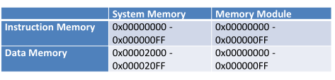

So, for memory I need to offset entered address by 0x00002000 i.e. 8192
bytes. Then I access the memory.

While compiling this module, Xilinx software gave the error saying that
my device could not slice the data due to lack of space so I had to use
bigger device. After that I simulated the device as:

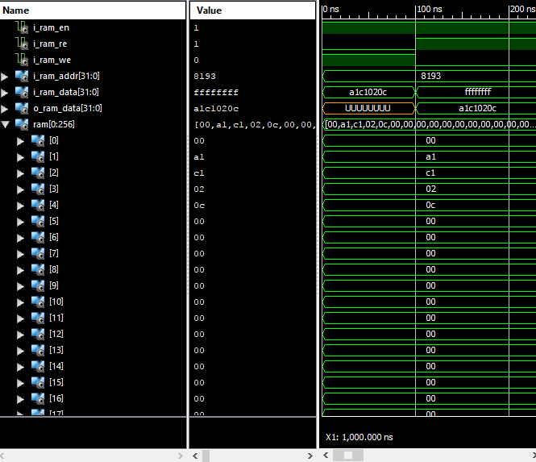

Here I first write the data on address 8193 which gets adjusted by 8192
to give address of 1. Then using bid endian it stores data a1c1020c

  |1    |2    |3    |4
  |---- |---- |---- |----
  |A1   |C1   |01   |0C

Also when I\_RAM\_WE is enabled the data is written to memory, while the
output (O\_RAM\_DATA) is Undefined. When I\_RAM\_RE is on and
I\_RAM\_WE\_IS off output is from memory address. And even though I
changed input data it did not change memory.

So combining all these module into my processor to calculate the
Fibonacci.

Processor
=========

I created a waveform simulation that shows the data in register \$t1
(\$9), \$t2 (\$10) and \$t3 (\$11).

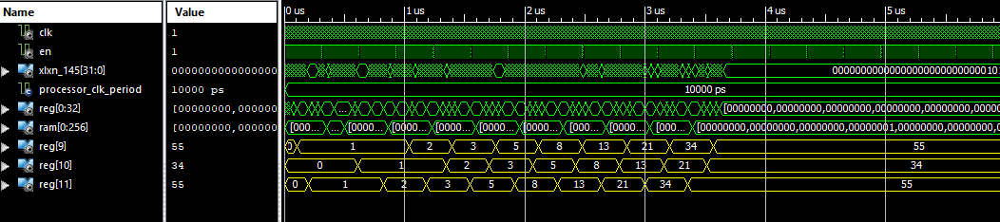

Here we can see how registers are initialized to \$9=1, \$10=0, and \$11
=1;

Based on assembly code we know for each loop, \$11 = \$9+\$10 is current
Fibonacci. Then it updates \$9 and \$10. In the wave we can see that
\$11 reaches 55 first and then \$9 and \$10 are updated. So my overall
design calculates the Fibonacci sequence.

My over all simulation wave is

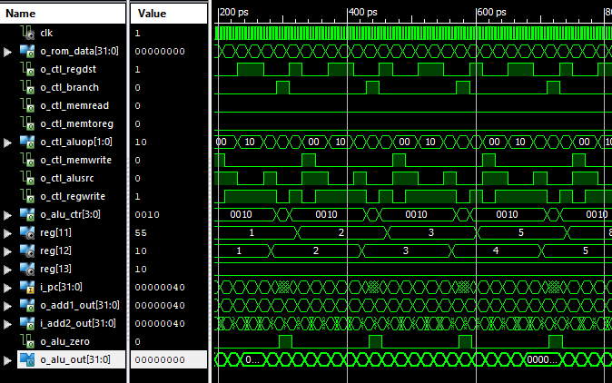

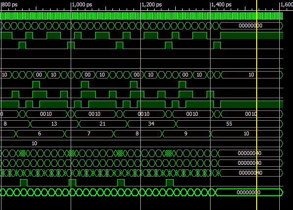

I ran the simulation for 1.6 ns using following test code:

SO each clock cycle is 5 ps and whole process runs for 1.6 ns.

Deliverables
============

1.  I described all the modules, their input and outputs, their place in
    overall design, their logic as well as simulation for most of them
    above.

2.  I followed the design from the lab instruction exactly except for
    adding an output after the 32 but mux selecting data for write back
    to register. I added it because Xilinx gave error during
    optimization saying there was no output and discarded my schematic.

> 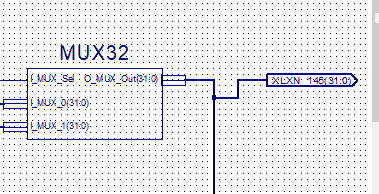

1.  My demonstration for each of 5 instructions are:

<!-- -->

a.  Addu

> In Fibonacci MIPS programming one of addu occurred on code
> 0b00000001001010100101100000100001 or 0x012a5821. It occurred on line
> 8 on 0-14 line scheme. So pc = 8\*4 = 32 = 0x00000020.
>
> In my wave form we can see it as:
>
> 
>
> Based on above waveform the addu gave following specification:

|Signal			|Value		|Note
|---			|---		|---
|Instruction	|0x012a5821	|This is current instruction in wave
|regdst			|1			|This addu result will be written to register from( 15:11) bit of code i.e. 0x01011 or $11 which is correct 
|branch			|0			It’s not branch
|memread		|0			|It does not do any memory operation
|memtoreg		|0			|It does not do any memory operation
|aluop			|0b00		|It does addition which has this op
|memwrite		|0			|It does not do any memory operation
|alusrc			|0			|It is r-type, so both ALU source is register
|regwrite		|1			|It writes back to register
|alu_ctr		|0b0010		|Addition on ALU
|Reg_file(9)	|2			|For this line, addu $t3, $t1, $t2, this is $t1 value
|Reg_file(10)	|1			|This is $t2 value

a.  Addi

For addi it is same as addu except the write register is second register
in code and second input to ALU is from immediate.

For this I looked at code 00100001100011000000000000000001or 0x0218c001
at line 13 in 0-14 line scheme, which corresponds to addi \$t4, \$t4, 1.
It increments loop counter \$t4 I looked at it because it is inside the
loop. It should be at PC = 13\*4 = 52 = 0x00000034.

So graph for this is:

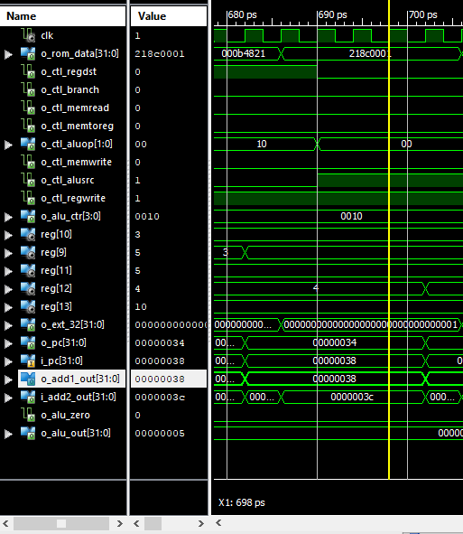

  |Signal          |Value        |Note
  |--------------- |------------ |---------------
  |Instruction     |0x0218c001   |It is addi instruction, addi \$t4, \$t4, 1 on MIPS code
  |regdst          |0            |It is I-type instruction which means write register is in (20:16) instruction bits
  |branch          |0            |No branch
  |memread         |0            |No memory operation
  |memtoreg        |0            |No memory operation
  |aluop           |0b00         |For add
  |memwrite        |0            |No memory operation
  |alusrc          |1            |2^nd^ ALU input is from sign extend
  |regwrite        |1            |Register write is enabled
  |alu\_ctr        |0b0010       |For addition
  |O\_ext          |0x00000001   |So extends 0x0001 to 32 bits by adding 0
  |Reg\_file(11)   |5            |This is the current fib stored on \$t3
  |Reg\_file(12)   |4            |Value at \$t4 or \$12, this is counter for loop that increments every loop, \$t4 = 4 means that current loop was 4^th^ loop that starts at loop 1.
  |Reg\_file(13)   |10           |This is the register \$t5 value that bne compares \$t4 to
  |Alu\_out        |0x00000005   |This is result of addition addi
  |O\_pc           |0x00000034   |Current instruction
  |I\_pc           |0x00000038   |Next instruction

a.  Addiu

Addiu only happens before loop when we are trying to initialize the
register values. I am looking at code li \$t1, 1 \# initialize \$t1,
which translates to addiu, \$t0, 0x00000001. This happened in line 1 in
0-14 line. So pc = 1\*4 = 4 =0x00000004. Code is
00100100000010010000000000000001 or 0x24090001.

The wave simulation of this is:

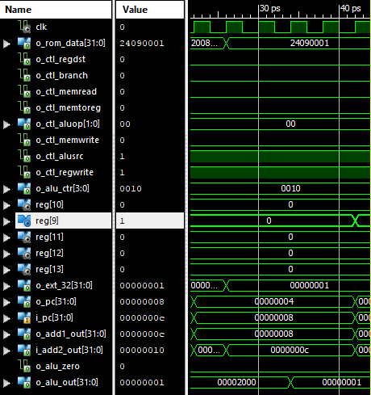

The description of this is:

 | Signal         |Value        |Note
 | -------------- |------------  |---
 | Instruction    |0x24090001   |Current instruction, addiu \$t1, \$0, 1
 | regdst         |0            |It is I-type instruction which means write register is in (20:16) instruction bits
 | branch         |0            |No branch
 | memread        |0            |No memory operation
 | memtoreg       |0            |No memory operation
 | aluop          |0b00         |add
 | memwrite       |0            |No memory operation
 | alusrc         |1            |Takes sign extended immediate for 2^nd^ ALU input
 | regwrite       |1            |
 | alu\_ctr       |ob0010       |add
 | O\_ext         |0x00000001   |Immediate 0x0001 extended by 4 byte. Its positive so add 1
 | Reg\_file(9)   |0x00000001   |It is 0 initially but after last rising edge of clock, i.e. WB stage for this instruction it becomes 1.
 | Alu\_out       |0x00000001   |Sum of 0 and 1
 | O\_pc          |0x00000004   |Current instruction address
 | I\_pc          |0x00000008   |Next address

a.  SW

We have only one sw statement. It is inside the loop that saves the
current fibonacchi to memery.

sw \$t3, 0(\$t0) \# write the next Fibonacci number to memory

So, \$t3 is currently caklculated fib, \$t0 is surrent address of RAM to
be updated.

In binary file it occurs in 9^th^ line in 0-14 line. So PC= 9\*4 = 36 =
0x00000024

And code is:

0b10101101000010110000000000000000 or 0xad0b0000

> 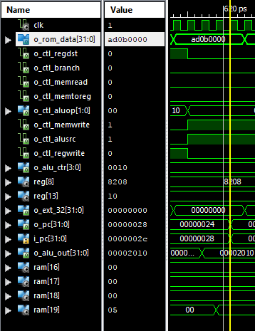

  |Signal          |Value        |Note
  |---			  |---
  |Instruction     |0xad0b0000   |Current instruction, sw \$t3, 0(\$t0)
  |regdst          |0            |
  |branch          |0            |
  |memread         |0            |
  |memtoreg        |0            |
  |aluop           |0b00         |Add operation
  |memwrite        |1            |Writes to memory
  |alusrc          |1            |Takes immediate as second ALU input
  |regwrite        |0            |Doesnot write to register
  |alu\_ctr        |0b0010       |Adds immediate to register
  |O\_ext          |0x00000000   |Extends 16 bit 0 to 32 bit 0
  |Reg\_file(0)    |8208         |It is the memory address which gets offset by RAM by 0x00002000 or 8192. So, \$t0 refers to 8208-8192 = 16th RAM address.
  |Reg\_file(11)   |5            |\$t3 has 5, which is 0x00000005, its stored big endian in ram
  |RAM(16)         |0x00         |Most significant bytes
  |RAM(17)         |0x00         |2n MSB
  |RAM(18)         |0x00         |2^nd^ LSB
  |RAM(19)         |0x05         |LSB, after 2^nd^ last clock cycle of this instruction i.e. after ME stage. Before that it was 0
  |Alu\_out        |0x00002010   |Equals 8208+0 = 8208, adds \$t0 data with immediate 0
  |O\_pc           |0x00000024   |Current, changes to next after WB
  |I\_pc           |0x00000028   |Next, changes after WB

a.  Bne

We have only one bne which is in last line of binary file.

Bne \$t5, \$t4, loop or bne \$13, \$12, 0xff9

It compares \$t4 and \$t5 and if they are equal it continues else it
goes to loop address. The code for this is:
0b00010101101011001111111111111001 or 0x15ACFFF9. It occurs on 14^th^
line so PC = 14\*4 = 56 = 0x00000038.

My simulation for this is:

> 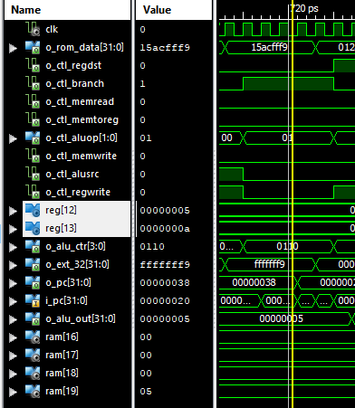

  |Signal          |Value        |Note
  |----			   |---			 |---
  |Instruction     |0x15ACFFF9   |
  |regdst          |0            |no write so ignore this
  |branch          |1            |Branch operation so enable this
  |memread         |0            |No memory operation
  |memtoreg        |0            |No memory operation
  |aluop           |0b01         |Subtraction for bne
  |memwrite        |0            |No memory operation
  |alusrc          |0            |Takes 2^nd^ input from register
  |regwrite        |0            |No register write
  |alu\_ctr        |0b0110       |Subtraction on ALU
  |O\_ext          |0xfffffff9   |So 0xff9 extends to 0xffffff9
  |Reg\_file(12)   |0x00000005   |Current loop is 5
  |Reg\_file(13)   |0x0000000a   |So last loop is 10
  |0\_alu\_out     |0x00000005   |So 10 -5 =5
  |O\_pc           |0x00000038   |Current address
  |I\_pc           |0x00000020   |Since, \$t13! =\$t12, next pc is output of add2. It continues the loop

1.  My processor starts when enable signal is on.

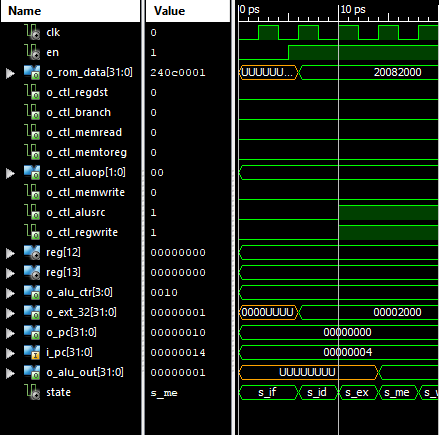

Here we can see that after enable signal is sent PC increments, FSM
state increment and ROM outputs the code.

My processor ends when the code runs out. Since ROM is initialized to
0s, after the PC points to the ROM address that does not have the code
my program goes to end state.

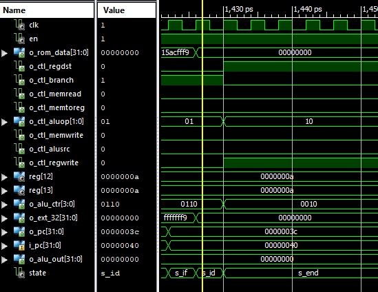

Here code is null, so state becomes s\_end. Then state does not change
and no change happens in Processor.

1.  MY memory contents after Fibonacci is calculated is

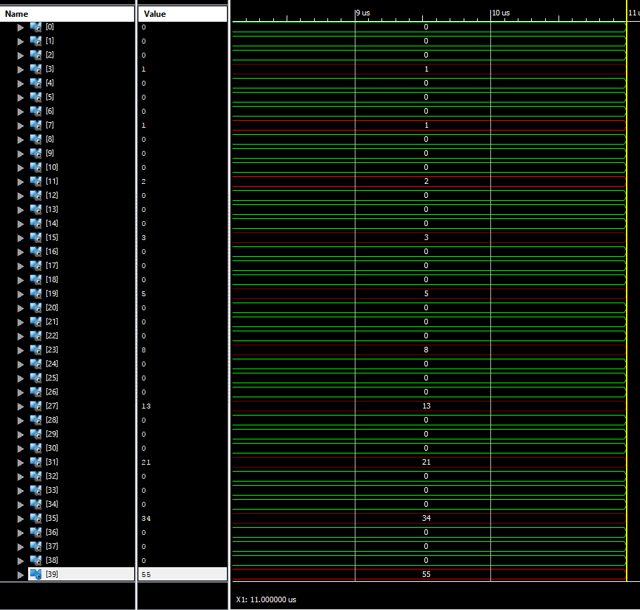

This is Fib stored on RAM address 0. By big endian memory has

  |0      |1      |2      |3
  |------ |------ |------ |------
  |0x00   |0x00   |0x00   |0x01

Similarly this is for second stores fib on address 4:

  |4      |5      |6      |7
  |------ |------ |------ |------
  |0x00   |0x00   |0x00   |0x01

For last fibs we have

  |32     |33     |34     |35
  |------ |------ |------ |--------------------
  |0x00   |0x00   |0x00   |0x22 (34 base 10)
  |36     |37     |38     |39
  |0x00   |0x00   |0x00   |0x 37 (55 base 10)

So for fib sequence that starts with 1^st^ =1, 2^nd^ = 1

32/4 = 8^th^ fib = 34

36/4 = 9^th^ fib = 55

This is correct sequence.

My whole memory snapshot is:

So, I have

  |Fib index:   |1     |2     |3      |4       |5       |6       |7       |8       |9       |10
  |------------ |----- |----- |------ |------- |------- |------- |------- |------- |------- |-------
  |RAM addr:    |0-3   |4-7   |8-11   |12-15   |16-19   |20-23   |24-27   |28-31   |32-35   |36-39
  |value        |1     |1     |2      |3       |5       |8       |13      |21      |34      |55

Conclusion
==========

This lab was combination of MIPS, VHDL, processor pipelines, and other
computer organization concepts. I created a processor that executes
different MIPS code and I could demonstrate them via simulation
waveforms.
